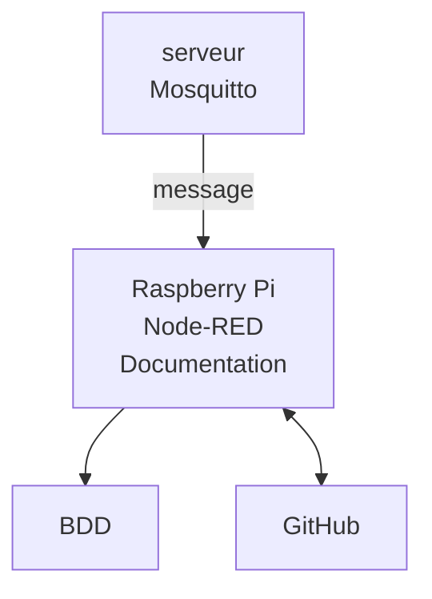
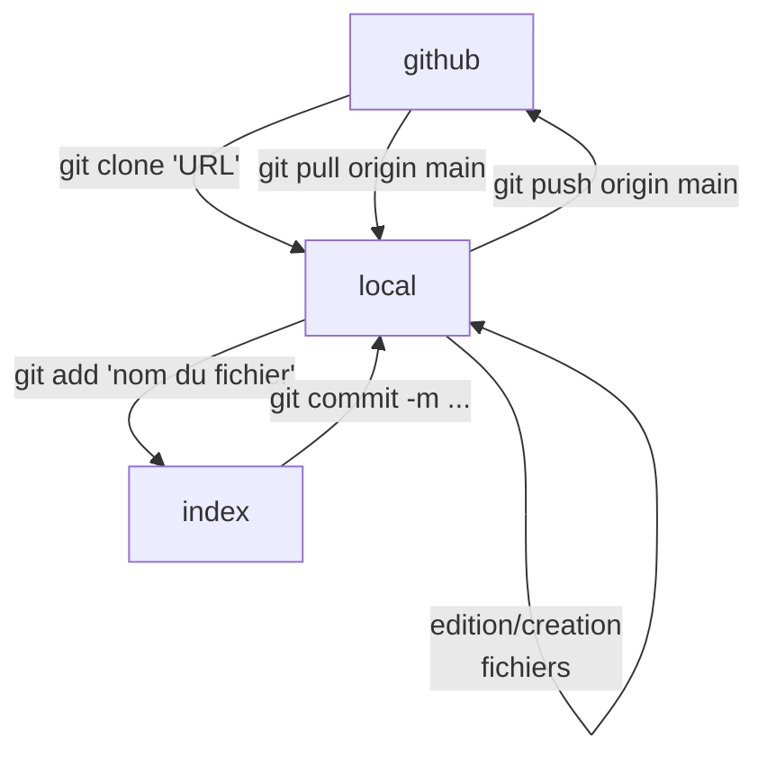

# test\_iut new

Projet test pour montrer l'utilisation

Ce que le projet va permettre :

* récupérer les messages
* les stocker en BDD
* les afficher
* utiliser Node-RED

Commandes : 
- cd [nom du projet (test_iut)]
- git add [nom du fichier (README.md)]
- git commit -m "Modification du README"
- git push origin main (pour envoyer du local ver GitHub)
- git pull origin main (pour envoyer de GitHub vers le local)
- git checkout -b [nom de la branche qu'on veut créer]
- git push origin [nom de la branche]
- git checkout [nom de la branche où on veut aller]

Ajouter une image :

