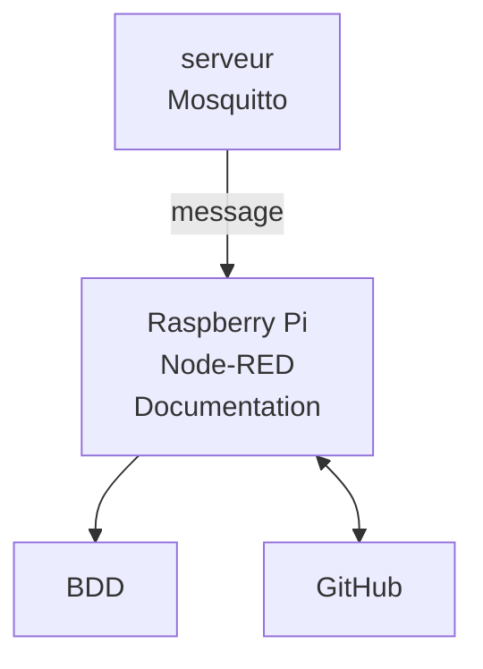
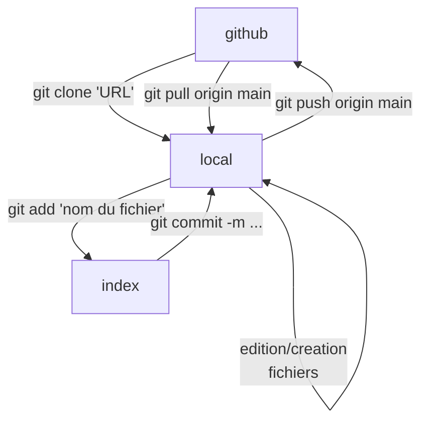

# test\_iut new

Projet test pour montrer l'utilisation

Ce que le projet va permettre :

* récupérer les messages
* les stocker en BDD
* les afficher
* utiliser Node-RED


Commandes : 
- cd [nom du projet (test_iut)]
- git add [nom du fichier (README.md)]
- git commit -m "Modification du README"
- git push origin main (pour envoyer du local ver GitHub)
- git pull origin main (pour envoyer de GitHub vers le local)
- git checkout -b [nom de la branche qu'on veut créer]
- git push origin [nom de la branche]
- git checkout [nom de la branche où on veut aller]
- git switch [nom de la branche où on veut aller]

Ajouter une image :



```mermaid
flowchart TD
    mosquitto[serveur<br>Mosquitto] --> |message| RPi[Raspberry Pi<br>Node-RED<br>Documentation]
    RPi --> BDD
    RPi <--> GitHub
```


```mermaid
flowchart TD
    github --> |git clone 'URL'| local
    local --> |git push origin main| github
    github --> |git pull origin main|local
    local --> |edition/creation<br> fichiers| local
    local --> |git add 'nom du fichier'| index
    index --> |git commit -m ...|local
```


=================================================
Modifications de E.G


==================================================
```sql
CREATE TABLE Étudiants (
	Id INTEGER NOT NULL,
	Nom TEXT(50),
	Prénom TEXT,
	Naissance TEXT(10),
	Email TEXT(100),
	CONSTRAINT Étudiants_PK PRIMARY KEY (Id)
);


--Afficher toutes les lignes de la table Étudiants
SELECT é.* FROM Étudiants AS é;

--Insertion d'une ligne dans la table
INSERT INTO Étudiants  (Id, Nom, Prénom, Naissance, Email)
VALUES(15, 'name', 'surname', '2000-01-15', 'ijffergfezghthgretr@free.fr');
INSERT INTO Étudiants  (Id, Nom, Prénom, Naissance, Email)
VALUES(16, 'Gil', 'LOPING', '2001-11-17', 'ijtyjtr@free.fr');
INSERT INTO Étudiants  (Id, Nom, Prénom, Naissance, Email)
VALUES(27, 'Milo', 'PARELO', '2002-03-24', 'sdfghthgretr@free.fr');

--Maj de l'email de l'étudiant dont l'id =20
UPDATE Étudiants
SET email = 'pierre.xxx@free.fr'
WHERE Id=20;

SELECT * FROM Étudiants
where naissance is null;

DELETE * FROM Étudiants
where naissance is null;


-- etudiants2 definition

CREATE TABLE etudiants2 (
	nom TEXT,
	prenom TEXT,
	age INTEGER,
	email TEXT,
	ville TEXT
);


SELECT e.*,e.rowid FROM etudiants2 AS e;

--Afficher les etudiants de plus de 18 ans 
SELECT nom, prenom, age FROM etudiants2 e 
WHERE age>18
ORDER BY nom;


--Afficher les etudiants entre 20 et 25 ans 
SELECT nom, prenom, age FROM etudiants2 e 
WHERE age between 20 and 25
ORDER BY nom;

--Afficher l'étudiant de Paris
SELECT nom, prenom, ville FROM etudiants2 e 
Where ville=='Paris';
```
